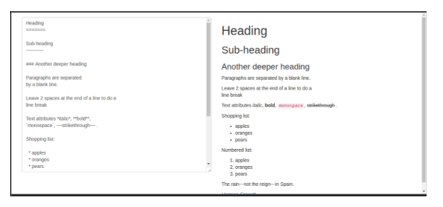

## Lab: Markdown Previewer

**Task**: Use the starter code provided to create a live Markdown editor using React. You should be able to type Markdown into a `<textarea>` and have the rendered HTML appear to the right of the `<textarea>` *as you type it*.

It should look something like this: 



#### Component Hierarchy

You will have two components in addition to App.js: 

```
<App />
  <DisplayContainer />
    <RawInput />
```

`<DisplayContainer>` should be the parent component of `<RawInput>`.

Here are some guidelines: 

* Your state should be initialized within the constructor method of the `<DisplayContainer>` component and should have one property `value` that has a value of the raw Markdown string.

```js
this.state = {
  value: ""
}
```

* Use the React `<textarea>` component to make the area where you type the HTML into. In React, `<textarea />` is a self-closing tag (unlike in regular HTML) and it has a `value` property that you can access.

* You will need to use the `dangerouslySetInnerHTML` property (which is how you do `innerHTML` using React) to insert the HTML into the viewing area on the right. Read about it [here](https://reactjs.org/docs/dom-elements.html#dangerouslysetinnerhtml). Basically, you need to put the html into an object assigned to a key named `__html` and assign the object to the `dangerouslySetInnerHTML` attribute in the element. Here is an example:

```js
var obj = {
  __html: "<p>some html <span>string</span> to insert</p>"
}

// Then in your JSX...
<div id="preview" dangerouslySetInnerHTML={obj}></div>

// It's complicated because it's dangerous
```

* Use the `marked` node module to convert the Markdown typed in your textarea into HTML. You need to install this in the root of the React project folder using the command `npm i marked`.

* Here is the basic usage of `marked`: 

```js
// import it where you need to use it
import marked from 'marked';

// Pass your textarea value into the `marked()` function
var result = marked('I am using __markdown__.');

console.log(result)
// Outputs: <p>I am using <strong>markdown</strong>.</p>
```

Since the result will be a string of HTML, you can use this for the value of your `__html` key in the object you assign to `dangerouslySetInnerHTML`.

## Hints:

* After the state is updated, in the render function for DisplayContainer, that is the best place to take the value from state, pass it into `marked()`, and get your HTML.